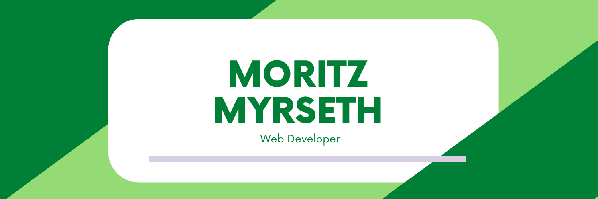

# Hi 👋 My name is Moritz Myrseth

## Web Developer

- 🌍 I'm based in Norway
- 🖥️ See my portfolio at [myrseth.dev](https://www.myrseth.dev)
- 🤓 Read my blog at [blog.myrseth.dev](https://blog.myrseth.dev)
- ✉️ You can contact me at [moritz@myrseth.dev](mailto:moritz@myrseth.dev)
- 🚀 I'm currently working on [Myrseth Technologies](https://www.myrseth.tech)

### Skills

### Certifications

  
  

## 📣 How about a quote before you go?

> Our greatest glory is not in never falling, but in rising every time we fall.
>
> 
- Confucius

Quote requested from [Random Quotes API](https://github.com/lukePeavey/quotable)

Check back at the top of the hour for a new quote!
